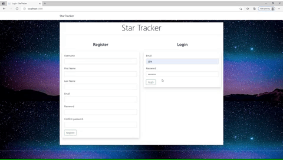
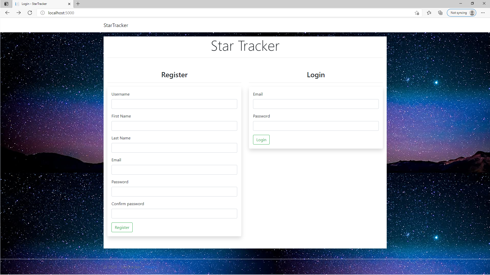
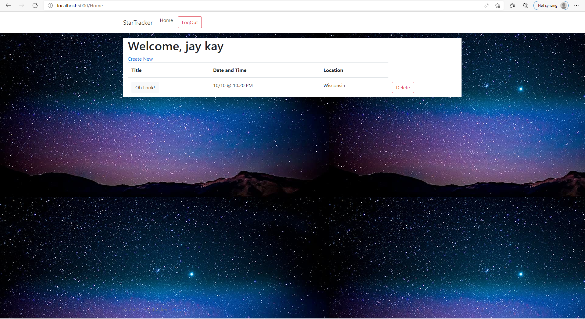
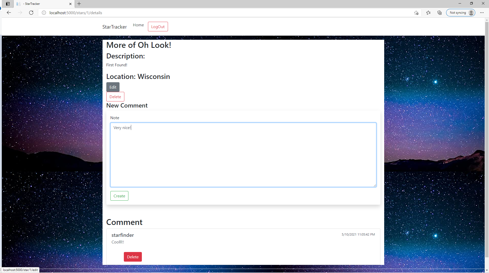

# Star Tracker
### User sharing star event Web

Creating a web platform where User share Stars Event.

##### ASP.NET core project

## About The Project
Welcome to the simple Star Event sharing web, created using .NET Core!
<br>

<br>
This website is built with the ASP.NET core basics, design front-end and back-end with C#. User can register/log in and allow to explore the website freely.
All users can register an event when they witness a star event. Other users can see the shared event to gather information, and anyone could comment on the post to communicate.

### Log in and Register Page

Starting page where users must log in to access the main page. If the user do not have an account, user must register to access.
* Validation is built in, 'user name' must be at least 4 characters long. First name and Last name must be at least 2 characters and Password must be at least 8 characters.
* If validation error occurs, the error message will display within the page without redirecting to different page.

### Main Page

Main page where users sees all the post from all users. Create post will be shown.
* log out option is now provided
* Users will see an option to delete the post they created.
* Click on title to see more details

### Detail Page

Detail page that shows more detail of the post and this is where users can comment.
* Users are now allow to comment on the post, they can delete their own comment as well.
* The post's user can edit the post. Only the owner can see the Edit and the Delete button.

### Built With
- C#
- ASP.NET Core
- Entity Framework
- SQL

## Getting Started
Begin the project by creating a base prject with .NET (replace 'ProjName' with anything)
```
dotnet new mvc --no-https -o ProjName
```
Install the necessary Entity Framework Core packages since database will be used.
```
dotnet add package Pomelo.EntityFrameworkCore.MySql --version 3.1.1
dotnet add package Microsoft.EntityFrameworkCore.Design --version 3.1.5
```
Change appsettings.json file to get access to the database. Give name and password (If the database source is different, the changes are made here)
* 'SQL_Username' and 'SQL_Password' is where real userid and password will be provided (can't write it here, for obvious reasons)
```
{
  "Logging": {
    "LogLevel": {
      "Default": "Information",
      "Microsoft": "Warning",
      "Microsoft.Hosting.Lifetime": "Information"
    }
  },
  "AllowedHosts": "*",
  "DBInfo": {
    "Name": "MySqlConnect",
    "ConnectionString": "server=localhost;userid=SQL_Username;password=SQL_Password;port=3306;database=YOUR_DB_NAME;SslMode=None"
  }
}
```
Add the ProjNameContext.cs to model, this is where it tells the starup that what data sets are being used/update.
```
using Microsoft.EntityFrameworkCore;
 
namespace ProjName.Models
{
    public class ProjNameContext : DbContext
    {
        public ProjNameContext(DbContextOptions options) : base(options) { }
 
        // for every model / entity that is going to be part of the db
        // the names of these properties will be the names of the tables in the db
        public DbSet<User> Users { get; set; }
 
        // public DbSet<Widget> Widgets { get; set; }
        // public DbSet<Item> Items { get; set; }
    }
}
```
Finally Startup.cs, must tell the project what context to use to send it to database.
And other services that are required, such as sessions, and mvc.
```
public void ConfigureServices(IServiceCollection services)
  {
    services.AddDbContext<ProjNameContext>(options => options.UseMySql(Configuration["DBInfo:ConnectionString"]));
    // to access session directly from view, corresponds with: @using Microsoft.AspNetCore.Http in Views/_ViewImports.cshtml
    services.AddHttpContextAccessor();
    services.AddSession();
    services.AddMvc(options => options.EnableEndpointRouting = false);
  }
```
...and for configure method...
```
 public void Configure(IApplicationBuilder app, IWebHostEnvironment env)
  {
      if (env.IsDevelopment())
      {
          app.UseDeveloperExceptionPage();
      }
      else
      {
          app.UseExceptionHandler("/Home/Error");
      }
 
      // css, js, and image files can now be added to wwwroot folder
      app.UseStaticFiles();
      app.UseSession();
      app.UseMvc(routes =>
      {
          routes.MapRoute(
              name: "default",
              template: "{controller=Home}/{action=Index}/{id?}");
      });
  }
```
Now the project should be set and ready to start

## Contact / About Me
Jin Kim - [Github](https://github.com/kimjin-012) - [LinkedIn](https://www.linkedin.com/in/jin-kim-code/)
